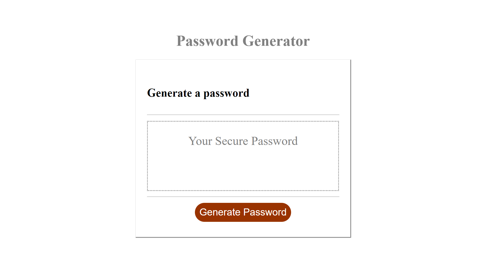

# Description
This is a simple random password generating webpage.

## Installation
N/A

## Usage
To use this tool, follow the below instructions. 
(1) click on this link https://hurlavic.github.io/Password-Generator/. You'll be presented with a text box and a button prompting you to generate a password. 
(2) Click on this button to genetrate a random password.
(3) You will get a screen prompt to enter a desired password length with a minimum of 10 characters and maximum of 64.
(4) Follow the subsequent prompts 
(5) A password is generated consisting of random letters (in different cases), numbers, special characters.

## Mock up

## Credit 
N/A

## License
Refer to license in repo.
